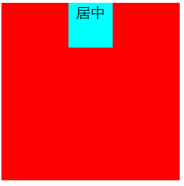
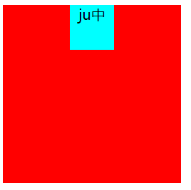
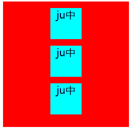

# CSS水平居中

#### 1. margin的auto属性

在左右方向上给**margin**的**auto**属性与**text-align: center**可以实现水平居中

```html
<html>
    <head>
    </head>
    <body>
        <div class="test">
            <div class="align-center">
                居中
            </div>
        </div>
    </body>
</html>
<style>
    .test{
        width: 200px;
        height: 200px;
        background: red;
    }
    .align-center{
        width: 50px;
        height: 50px;
        text-align: center;
        margin: 0 auto;
        background: aqua;
    }
</style>
```



**tips：**auto属性并不能实现竖直居中

#### 2.flex的align-items实现水平居中

利用列方向上的**flex**的**align-items**与**text-align: center**属性可实现水平居中

```html
<html>
    <head>
    </head>
    <body>
        <div class="flex-center">
            <div class="flex-item">ju中</div>
        </div>
    </body>
</html>
<style>
    .flex-center{
        width: 200px;
        height: 200px;
        background: red;
        display: flex;
        flex-direction: column;
        align-items: center;
    }
    .flex-item{
        width: 50px;
        height: 50px;
        background: aqua;
        text-align: center;
    }
</style>
```



**tips:**这个属性只能在flex方向是column的情况下才能实现，但是可以实现批量的居中。



**本文贡献者**：叶枫（Leaf Maple）

