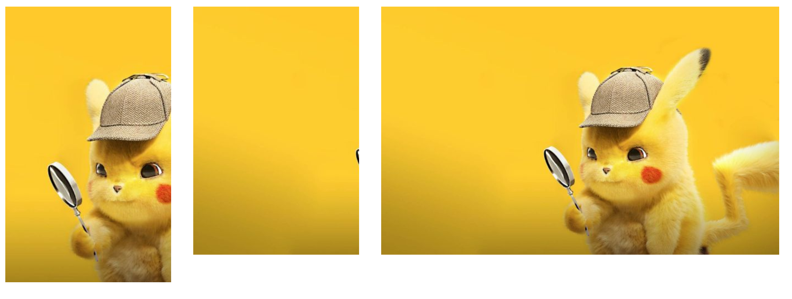

# 图片等比例裁切后按固定尺寸显示

```html
<html>
	<head>
    </head>
    <body>
        <div class="back">
            
        </div>
    </body>
</html>
<style>
    .back{
        height: 50px;
        width: 30px;
        background-image: url(../../static/common/leaf_maple.png" height="25px);
        background-repeat: no-repeat;
        background-size: cover;
        background-position: center;
    }
</style>
```

话不多说，直接上图。

从左至右依次是：固定尺寸裁剪与按比例缩放，固定尺寸裁剪但是不缩放，原图



**tips:****千万不要忘了**no-repeat**属性

**本文贡献者**：叶枫（Leaf Maple）

